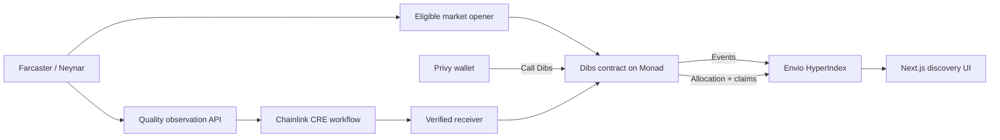

# Dibs — Monad Metropolis submission

> Discover early Farcaster casts, back your conviction with MON, and build an onchain record of taste.

## Live product

- App and Farcaster Mini App: https://dibs-metropolis.vercel.app/discover
- Monad testnet contract: `0x0fFd42613e0Bd0f328C23DeCB7c33f81B2490F84`
- CRE receiver: `0x78B87B938cbdd9453F2dA6adA043d74d792C9A81`
- Public CRE simulation fixture: https://dibs-metropolis.vercel.app/api/oracle/simulation-fixture
- Judge-facing simulation console: https://dibs-metropolis.vercel.app/simulation
- Public integration health: https://dibs-metropolis.vercel.app/api/health

## What judges should test

1. Connect through Privy and optionally link a Farcaster account.
2. Open **Discover** and choose a live Envio-indexed market.
3. Call Dibs, approve the Monad transaction, and watch conviction and rank update.
4. Open the market and inspect the Envio-indexed early-scout ledger.
5. Open the scout address to see its public, shareable reputation record.
6. Open **Activity → CRE simulation** to inspect the explicitly labeled quality-settlement proof.

The main feed excludes the initial seven-day rehearsal market. Judge-facing discovery contains
only final-format windows no longer than 24 hours, while legacy history remains available by
direct market URL and on scout profiles.

## Architecture



## Sponsor integrations

| Integration | Product role | Evidence |
| --- | --- | --- |
| Monad | Markets, conviction curve, challenge bonds, allocations and claims | Deployed contract plus Foundry lifecycle tests |
| Envio | Live ranking, positions, activity, settlement and reputation data | Production `/api/casts`, scout ledger and GraphQL-backed profiles |
| Privy | Wallet authentication, embedded wallet support and Farcaster account linking | Production connect and profile-link flows |
| Farcaster | Source of eligible casts and Mini App distribution | Valid signed account association and live Mini App manifest |
| Chainlink CRE | Deterministic quality scoring, challenge re-observation and report preparation | Reproducible, explicitly labeled dry-run evidence in `oracle/SIMULATION_EVIDENCE.md` |

## Integrity boundary

The CRE evidence is a dry-run simulation. It proves observation fetching, deterministic quality filtering, score calculation, normal settlement calldata, challenged-market correction calldata and report preparation. It does **not** claim a production CRE report was broadcast. Contract-side forwarding, allocation, challenge and claim behavior are independently covered by Foundry tests.

New markets store a versioned quality-weighted opening baseline. Legacy markets remain readable and use the documented raw-interaction compatibility path.

## Verification

```bash
npm test
npm run typecheck
npm run build
forge test --root contracts
cd indexer && npm run codegen && npm run typecheck
cd ../oracle && npm test && npm run typecheck
```

## Demo recording outline

- 0:00–0:20 — Why popularity feeds miss early cultural signal.
- 0:20–1:00 — Live Farcaster market, Privy wallet and Dibs confirmation.
- 1:00–1:25 — Conviction and rank move; Envio position appears.
- 1:25–2:05 — CRE simulation rejects weak identities and produces weighted growth.
- 2:05–2:35 — Contract-tested settlement, reward claim and public scout reputation.
- 2:35–2:50 — Architecture and explicit production/simulation boundary.
