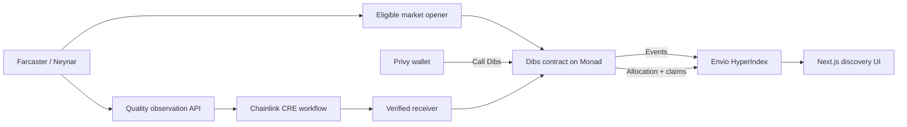

# Dibs — Monad Metropolis submission

> Discover early Farcaster casts, back your conviction with MON, and build an onchain record of taste.

## Live product

- App and Farcaster Mini App: https://dibs-metropolis.vercel.app/discover
- Monad testnet contract: `0x0fFd42613e0Bd0f328C23DeCB7c33f81B2490F84`
- CRE receiver: `0x78B87B938cbdd9453F2dA6adA043d74d792C9A81`
- CRE forwarder: `0xF8344CFd5c43616a4366C34E3EEE75af79a74482`
- Active CRE workflow: `dibs-settlement-testnet`
- Workflow ID: `0x00733a308f4ccaf2b3bdf6952866e293ce85b31be878e6883c54390b944b72fb`
- Judge-facing CRE console: https://dibs-metropolis.vercel.app/simulation
- Live acceptance ledger: https://dibs-metropolis.vercel.app/evidence
- Public integration health: https://dibs-metropolis.vercel.app/api/health
- Verified DON settlement (market 32): `0x8d0fa1b3d862e896c8fe161b22928a64089ae96adb8281fde03fd588306b5fd4`
- Verified positive DON settlement (market 33): `0xeee2341f26b475d0c1f44a69625d4f6b640326b357313ca132e85aa7cece887a`

## What judges should test

1. Connect through Privy and optionally link a Farcaster account.
2. Open **Discover** and choose a live Envio-indexed market.
3. Call Dibs, approve the Monad transaction, and watch conviction and rank update.
4. Open the market and inspect the Envio-indexed early-scout ledger.
5. Open the scout address to see its public, shareable reputation record.
6. Open **Activity → Chainlink DON** to inspect the active workflow, authenticated receiver, and production settlement boundary.
7. Open **Live evidence** and inspect the two Monad transactions emitted through the official Keystone Forwarder.

The main feed excludes the initial seven-day rehearsal market. Judge-facing discovery contains
only final-format windows no longer than 24 hours, while legacy history remains available by
direct market URL and on scout profiles.

## Architecture



## Sponsor integrations

| Integration | Product role | Evidence |
| --- | --- | --- |
| Monad | Markets, conviction curve, challenge bonds, allocations and claims | Deployed contract plus Foundry lifecycle tests |
| Envio | Live ranking, positions, activity, settlement and reputation data | Production `/api/casts`, scout ledger and GraphQL-backed profiles |
| Privy | Email/passkey/Farcaster authentication, automatic embedded wallets, Farcaster account linking, server-verified nominations, user-confirmed Monad transactions and embedded-wallet gas sponsorship | Live identity-to-action proof at `/privy`, production health status, and wallet transaction path |
| Farcaster | Source of eligible casts and Mini App distribution | Valid signed account association and live Mini App manifest |
| Chainlink CRE | Scheduled DON execution, deterministic quality scoring, challenge re-observation and authenticated Monad report delivery | Active private-registry workflow plus confirmed DON writes and events recorded in `evidence/live-don-settlement` |

## Integrity boundary

Dibs settlement is deployed on the Chainlink DON. The active private-registry workflow
`dibs-settlement-testnet` runs every two minutes in bounded batches. Each DON node computes the
quality score and canonical evidence hash before consensus, so large interaction lists do not enter
the consensus observation. Onchain reads skip already-processed markets before reports are sent
through the official Monad testnet Keystone Forwarder. The
receiver accepts that forwarder, requires the pinned workflow ID, binds reports to chain `10143`
and the deployed Dibs contract, and forwards only `submitResult` or `resolveChallenge` calls.

The live path is proven by two successful Forwarder transactions. Market 32 recorded a zero-growth
result at block `68455332`; market 33 recorded a positive quality-growth score of `6685` at block
`68455340`. Both transactions emitted `SettlementReportForwarded` from the receiver and
`ResultSubmitted` from Dibs. The workflow registry reports `ACTIVE`, and its latest observed run on
2026-10-07 completed with status `SUCCESS`.

The older fixture and `simulate --broadcast` artifacts remain checked in as explicitly historical
reproduction evidence. They are not the production settlement claim. The observation API currently
aggregates Neynar data before CRE consensus; this external-data trust boundary is disclosed rather
than presented as direct node-to-Neynar access. `/evidence` also keeps unrelated field proofs—such
as a live upheld challenge and non-zero scout reward claim—pending until genuine users create them.

The October 7 consensus incident is retained with its verified recovery in
[`evidence/cre-recovery-2026-10-07`](evidence/cre-recovery-2026-10-07/README.md): ten DON nodes agreed
on a 2,350-byte payload, and the first recovered scheduled run delivered eight authenticated Monad
reports. This includes real receipts and regression tests rather than an increased quota or fixture.

New markets store a versioned quality-weighted opening baseline. Legacy markets remain readable and use the documented raw-interaction compatibility path.

## Verification

```bash
npm test
npm run typecheck
npm run build
forge test --root contracts
cd indexer && npm run codegen && npm run typecheck
cd ../oracle && npm test && npm run typecheck
```

## Demo recording outline

- 0:00–0:20 — Why popularity feeds miss early cultural signal.
- 0:20–0:45 — Privy sign-in, automatic embedded wallet and linked Farcaster identity.
- 0:45–1:00 — User-approved Dibs transaction with sponsored embedded-wallet gas.
- 1:00–1:25 — Conviction and rank move; the Envio position resolves to the scout identity.
- 1:25–2:05 — Active CRE DON workflow scores observations and authenticates a Monad report.
- 2:05–2:35 — Inspect `ResultSubmitted`, `SettlementReportForwarded`, Envio indexing and scout reputation.
- 2:35–2:50 — Architecture, production trust boundary, and honestly labelled pending field proofs.
